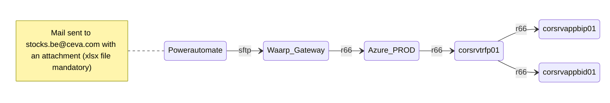

# 🔁 Transfert de Fichier : stocks.be@ceva.com 

## 🟦 Source
- **Mail** : `stocks.be@ceva.com`

## 🟩 Destination
- **Name** : `Talend v7`
- **Directory** :  /project_resources/dev/CVALUE/data/in/be/STOCKS/

## Miscellanous
- **Rules** :CRM_WHOLESALER_STOCKS_EU_GB_DEV // CRM_WHOLESALER_STOCKS_EU_GB
- **Talend plan** : CRM_WHOLESALER_STOCKS_EU_BE

## 🔐 Protocole
- **Protocoles utilisé** : `sftp and r66`

## ➡️ Flow

